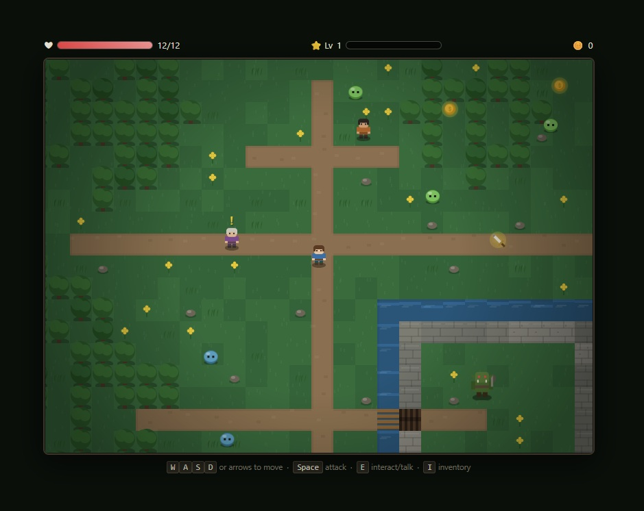
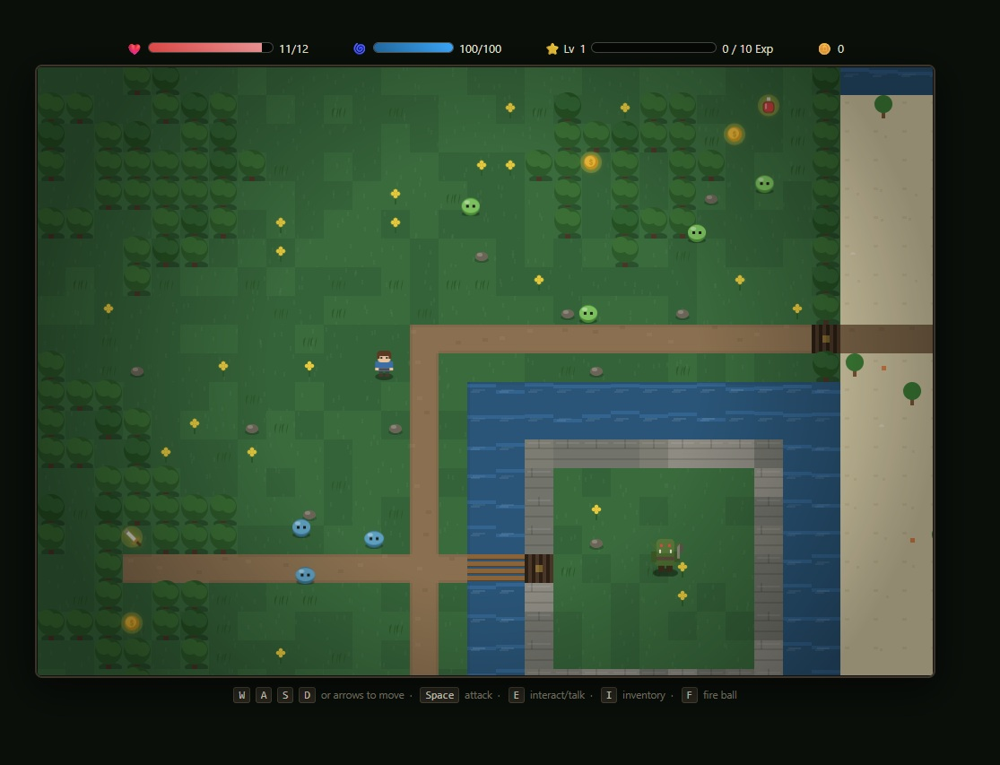
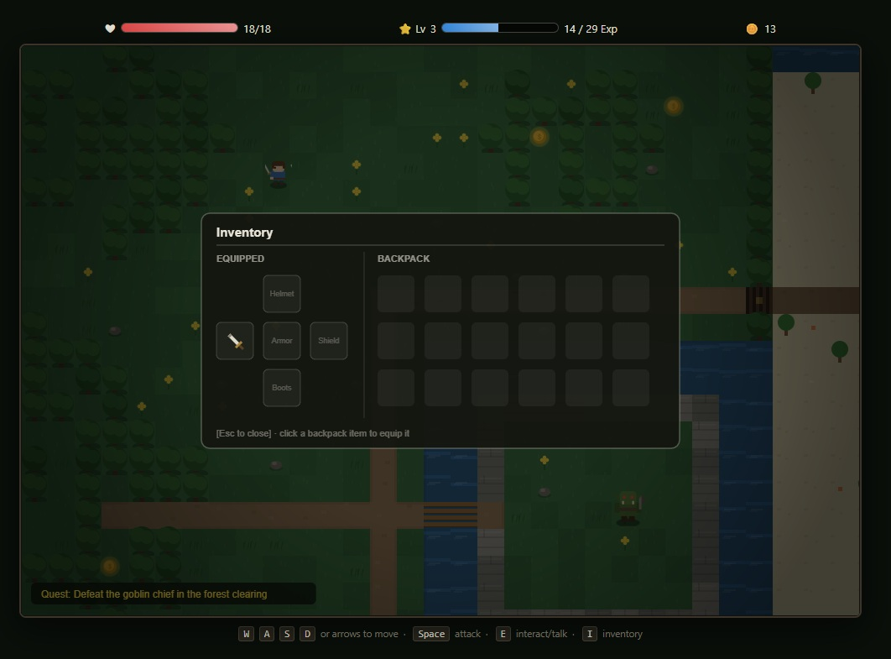
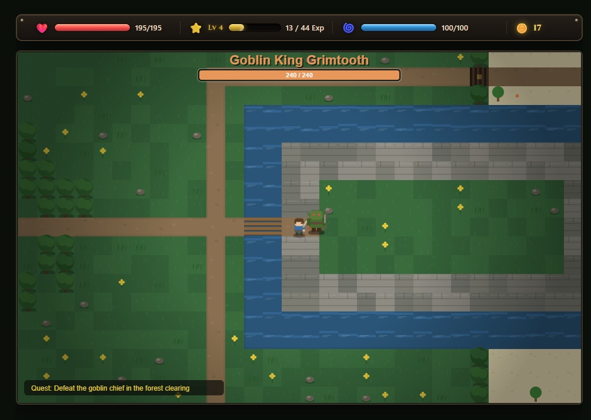
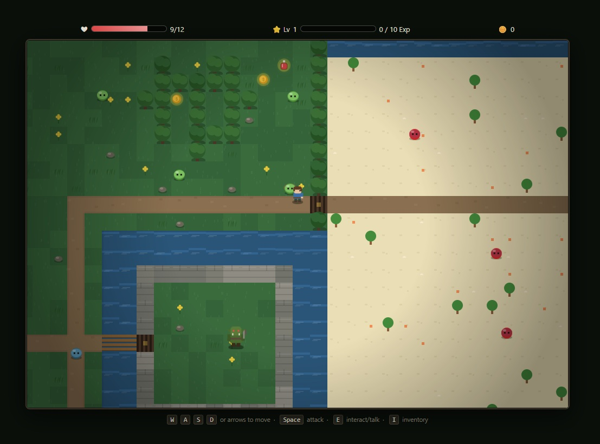
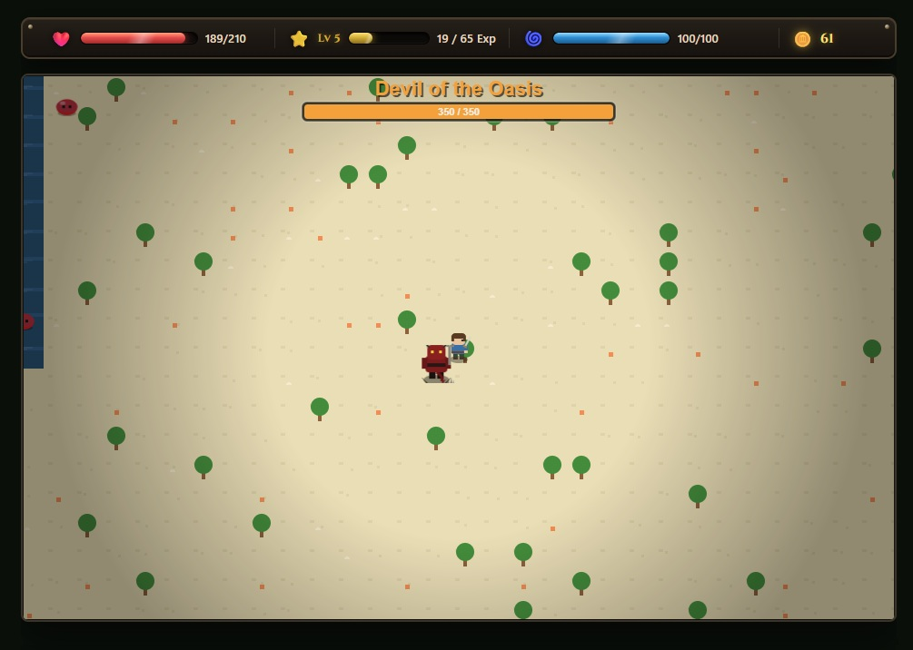
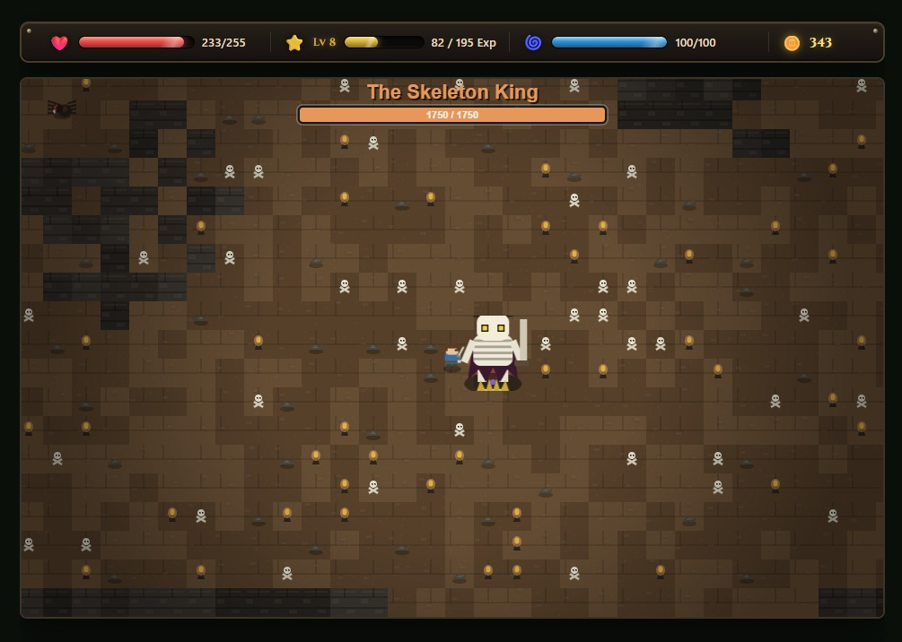

# Shattered Vale

A top-down action RPG built with vanilla JavaScript and HTML5 Canvas — no engine, no build step, no dependencies. Explore a village, talk to NPCs, find a hidden sword, battle slimes, and defeat the goblin chief to save the village.









## Playing

No installation or server required — just open `index.html` in a browser.

## Architecture

```
├── index.html                      entry page: game canvas + DOM HUD (hp/xp/mana bars, level, gold)
├── css/
│   └── style.css                   canvas and HUD panel styling
└── js/
    ├── utils.js                    shared math/canvas helpers (clamp, lerp, dist, rectsOverlap, roundRect, hashTile) + makeCanvas (offscreen canvas creation, shared by sprites/tilemap) + wrapPlainText (text wrapping, shared by the UI screens)
    │
    ├── config/                     ← pure data, no rendering, no class instantiation
    │   ├── balance.js               every balance number: player stats (hp/atk/speed/mana), level-up progression, weapon bonuses, per-enemy-type stats (ENEMY_DEFS), XP/gold kill rewards (COMBAT_REWARDS)
    │   ├── level-layout.js          world content: NPC dialogue (Elder, Merchant), world item placements, the full 86-entry enemy list (previously duplicated between initial setup and restartGame), boss display names, player spawn point
    │   └── item-effects.js          pickup/equip/unequip effect tables (toast text, player-state changes, screen-flash colors), boss-defeat drop/cutscene scripts, gate-unlock conditions (which enemies must be dead before a gate opens)
    │
    ├── sprites/                    ← procedural pixel-art generation
    │   ├── humanoid-sprites.js      palette-swappable humanoid sprite-sheet builder (used for player/elder/merchant) + sword weapon overlay
    │   ├── monster-sprites.js       sprite-sheet builders for every enemy: slimes, goblin/devil/orc/witch bosses, spider, skeleton, Skeleton King
    │   ├── icon-sprites.js          24x24 procedural item icons (sword, potions, armor, coin, key, shield, boots, etc.) used in world pickups and the inventory panel
    │   └── sprites.js               the Sprites registry object + initSprites(), which calls the builders above once at boot and stores every sheet/icon
    │
    ├── world/                      ← the tile map
    │   ├── tilemap-builder.js       tile type definitions (TileType enum, SOLID_TILES) + world/jungle/crypt terrain generation, gate tile definitions (GATE_DEFS)
    │   ├── tilemap-renderer.js      per-tile ground rendering, terrain edge blending, decoration drawing (flowers, rocks, ferns, bones, etc.)
    │   └── tilemap.js               TileMap class: owns the tile grid and gate state, composes the builder + renderer functions above, bakes the static layer to an offscreen canvas
    │
    ├── entities/
    │   ├── animated-sprite.js       shared sprite-sheet frame-walker, used by Player/NPC/Enemy to animate their 4-directional walk cycles
    │   ├── player.js                Player class: movement, melee/fireball combat, leveling — reads starting stats from config/balance.js
    │   ├── npc.js                   NPC class: talkable characters, now also draws its own "Talk with me" speech bubble (moved out of the main draw loop since it's the NPC's own visual state)
    │   ├── enemy.js                 Enemy class: wander/aggro AI, telegraphed attacks, taking damage — driven entirely by the ENEMY_DEFS table in config/balance.js instead of a 130-line if/else chain
    │   └── fireball.js              Fireball projectile class — reads speed/damage/life from config/balance.js's FIREBALL_STATS
    │
    ├── systems/
    │   ├── camera.js                smooth player-follow camera with screen-shake, clamped to map bounds
    │   ├── particles.js             lightweight particle burst + floating damage/XP text system
    │   ├── dialogue.js              typewriter-style dialogue box UI (renders whatever npc.dialogue array it's given)
    │   └── inventory.js             world item pickups + toggleable inventory panel (equip slots, backpack grid); added a new Inventory.reset() method used by both the constructor and restart
    │
    ├── ui/
    │   ├── hud.js                   binds/syncs the DOM hp/xp/mana bars, plus the canvas-drawn boss health banner, toast messages, and quest tracker
    │   └── screens.js               full-screen canvas UI states: desktop-only block screen, start menu, how-to-play panel, game-over/restart screen
    │
    └── core/
        ├── input.js                 keyboard state tracking (keys/justPressed) + mobile-device detection
        ├── world-factory.js         turns the plain data in config/level-layout.js into live NPC/WorldItem/Enemy instances; used both at boot and on restart, eliminating the old duplicated 86-line enemy list
        ├── combat.js                 resolves player interaction: talking to NPCs, melee hit resolution,
        │                             XP/gold/loot rewards, world-item pickups, inventory-panel clicks, gate-unlock checks
        └── game.js                   bootstrap + main update/draw loop + restart logic
```

Double-click `index.html`, or serve the folder locally if your browser restricts local file access:

```bash
# from inside the shattered-vale-rpg folder
python3 -m http.server 8000
# then visit http://localhost:8000
```

## Controls

| Key                           | Action                  |
| ----------------------------- | ----------------------- |
| `W` `A` `S` `D` or Arrow Keys | Move                    |
| `Space`                       | Attack                  |
| `E`                           | Talk to NPCs / interact |
| `I`                           | Toggle inventory        |

## How to play

1. Explore the village and find **Elder Rowan** — talk to him (`E`) to start the quest.
2. Head east to the pond and pick up the **Iron Sword** lying in the grass.
3. Fight **slimes** scattered around the map for gold and XP; leveling up increases your max HP and attack.
4. Visit the **Wandering Merchant** for a free health potion.
5. Head to the forest clearing in the southeast and defeat the **Goblin Chief** to win.

Your HP, level/XP, and gold are tracked in the HUD above the game canvas. If your HP reaches 0, refresh the page to try again.

## Features

- **Procedurally drawn sprites** — layered, directional character sheets (no external image assets) for the player, NPCs, slimes, and the goblin boss, each with walk-cycle animation
- **Textured world** with autotile edge-blending between grass/path/sand/water, a bridge, animated water shimmer, and scattered decoration (flowers, rocks, tall grass)
- **Depth-sorted rendering** so characters visually overlap correctly based on their position
- **Combat system** with hitboxes, knockback-free contact damage, hit-flash feedback, and a telegraphed boss attack
- **Particle effects** — hit bursts, floating damage/XP numbers, footstep sparkles, screen shake and flash on level-up
- **Typewriter-style dialogue box** with a simple branching-free quest conversation
- **Inventory panel** for collected items (potions, keys, etc.)
- **Smooth camera** that follows the player and clamps to the map bounds

## Project structure

| File              | Responsibility                                                                       |
| ----------------- | ------------------------------------------------------------------------------------ |
| `index.html`      | Page shell, HUD markup, canvas element, script loading order                         |
| `css/style.css`   | Game styles                                                                          |
| `js/utils.js`     | Shared math/helper functions (clamp, lerp, collision, rounded rects)                 |
| `js/sprites.js`   | Procedural sprite sheet generation for every character and item icon                 |
| `js/tilemap.js`   | World generation, tile textures, collision, static-layer baking                      |
| `js/particles.js` | Particle bursts and floating combat text                                             |
| `js/entities.js`  | `Player`, `NPC`, and `Enemy` classes, animation, and AI                              |
| `js/dialogue.js`  | Dialogue box UI and typewriter text reveal                                           |
| `js/inventory.js` | World item pickups and the inventory panel UI                                        |
| `js/camera.js`    | Camera follow/shake logic                                                            |
| `js/game.js`      | Game loop, input handling, state management, HUD updates — wires everything together |

Scripts are loaded in dependency order via plain `<script>` tags (no bundler needed): `utils` → `sprites` → `tilemap` → `particles` → `entities` → `dialogue` → `inventory` → `camera` → `game`.

## Customizing

A few starting points if you want to extend it:

- **Add an enemy type** — add a new palette/sprite builder in `sprites.js`, then instantiate it via `new Enemy(x, y, 'yourType')` in `game.js`. Enemy stats (HP, speed, damage) are set in the `Enemy` constructor in `entities.js`.
- **Expand the map** — edit `TileMap` in `tilemap.js`; increase the `cols`/`rows` passed into `new TileMap(...)` in `game.js` and add new features inside `_buildWorld()`.
- **Add dialogue/NPCs** — create a new `NPC(...)` in `game.js` with a `dialogue` array of strings; push it into the `npcs` array.
- **Add items** — draw a new icon function in `sprites.js`, register it in `Sprites.icons`, then place a `new WorldItem(x, y, 'yourKind')` in `game.js`.

## Browser support

Any modern browser with Canvas2D support (Chrome, Firefox, Safari, Edge). No mobile touch controls are implemented — keyboard required.

## License

Free to use, modify, and build on for any purpose.
